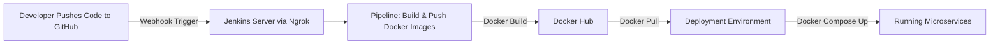

# 🚀 CI/CD Pipeline for Dockerized Microservices

## 📈 Overview

This project demonstrates a **real-world DevOps workflow** for a **microservices-based Node.js application** using a **monorepo** approach. It automates the entire process from pushing code to GitHub to building Docker images, pushing them to Docker Hub, and deploying them automatically.

The project is designed to showcase:

* **Continuous Integration** with GitHub Webhooks & Jenkins.
* **Continuous Deployment** using Docker & Docker Compose.
* **Monorepo management** for multiple services.
* **Local webhook testing** using Ngrok.

---

## 🛠️ Tech Stack

| Category             | Tools/Technologies       |
| -------------------- | ------------------------ |
| **Version Control**  | Git, GitHub              |
| **CI/CD**            | Jenkins, GitHub Webhooks |
| **Containerization** | Docker, Docker Compose   |
| **Networking**       | Ngrok                    |
| **Registry**         | Docker Hub               |
| **Languages**        | Node.js (JavaScript)     |

---

## 📂 Monorepo Structure

```
ecommerce-microservices/
|
├── user-service/
│   ├── Dockerfile
│   └── src/
│
├── product-service/
│   ├── Dockerfile
│   └── src/
│
├── order-service/
│   ├── Dockerfile
│   └── src/
│
├── docker-compose.yml
└── Jenkinsfile
```

---

## 🔄 Workflow Architecture



---

## 🔄 CI/CD Flow

1. **Push to GitHub** → Code changes are committed & pushed.
2. **GitHub Webhook** → Sends payload to Jenkins via **Ngrok**.
3. **Jenkins Pipeline** → Builds Docker images & pushes them to **Docker Hub**.
4. **Deployment** → Docker Compose pulls latest images & restarts services.

---

## 🔑 Setup Instructions

### 1. Clone the Repository

```bash
git clone https://github.com/Jenish-Patel31/ecommerce-microservices.git
cd ecommerce-microservices
```

### 2. Configure DockerHub Credentials in Jenkins

* Add a new **Username with password** credential in Jenkins with ID: `dockerhub`.

### 3. Setup GitHub Webhook

* Go to **GitHub Repo → Settings → Webhooks**.
* Payload URL: `https://<ngrok-url>/github-webhook/`
* Content Type: `application/json`
* Trigger: **Just the push event**.

### 4. Start Ngrok

```bash
ngrok http 8080
```

* Copy the forwarding URL into your GitHub webhook settings.

### 5. Run Jenkins Pipeline

* Triggered automatically when you push code.

---

## 📊 Outputs

* Docker images pushed to **Docker Hub**:

  * `jenishpatel31/user-service:latest`
  * `jenishpatel31/product-service:latest`
  * `jenishpatel31/order-service:latest`
* Services deployed locally via Docker Compose.

---

## 🌟 Key Highlights

* **End-to-End Automation** from code push to deployment.
* **Secure Secret Management** in Jenkins.
* **Ngrok Integration** for local webhook testing.
* **Multi-Service Deployment** with Docker Compose.

---

## 📢 Contact

**Jenish Patel**
[LinkedIn](https://linkedin.com/in/jenish-patel-31k) | [GitHub](https://github.com/Jenish-Patel31)
